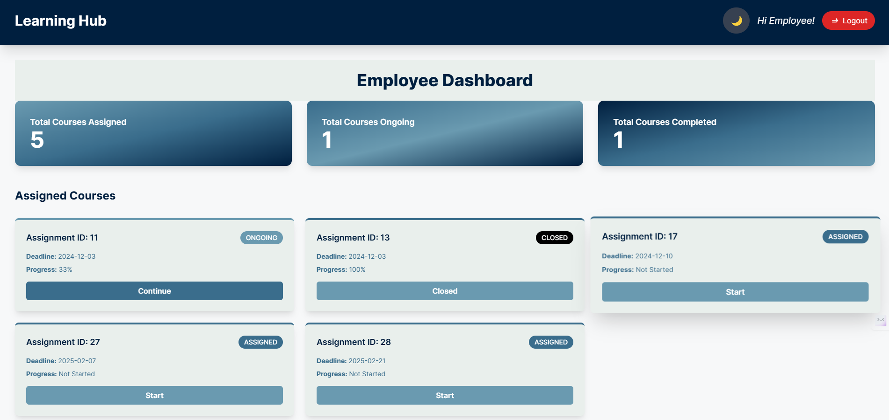
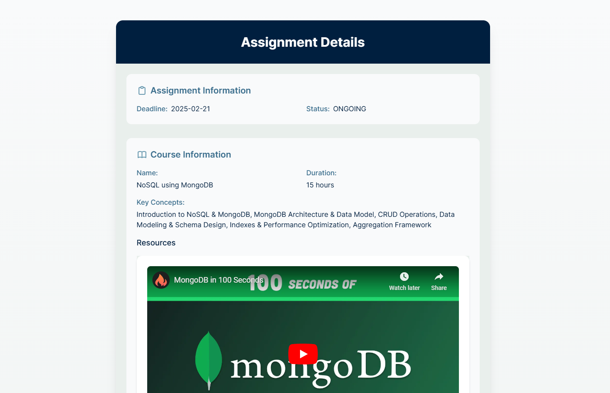
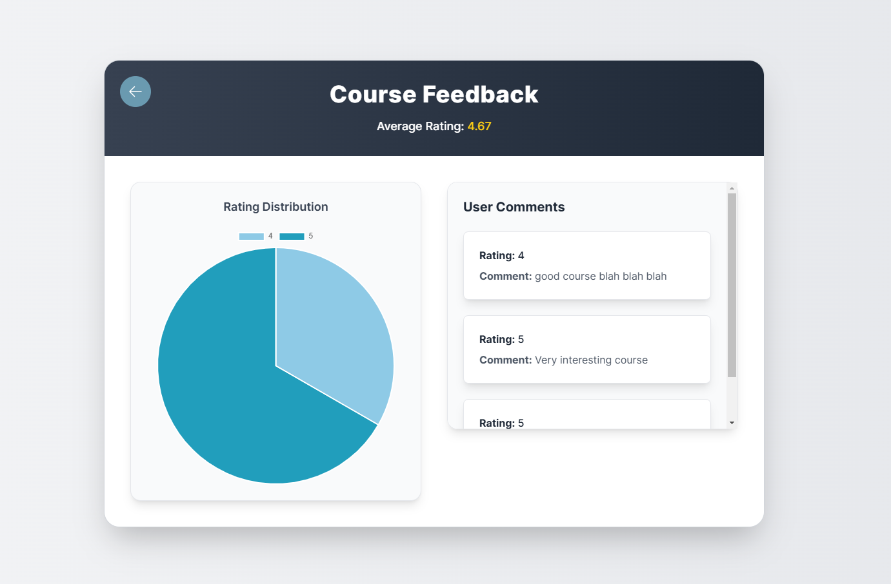

# LGD: Employee Training Platform

## 🚀 Overview

**LGD** is a **web application** designed to streamline employee training, aligning learning paths with real-world project needs. The platform ensures that employees receive **structured, relevant, and timely training** to enhance productivity and efficiency in fast-paced corporate environments.

## 📌 Features

- **Course Request System** – Managers can request specific courses for employees based on project needs.
- **Modular Course Creation** – Trainers can create new courses or assign existing ones.
- **Role-Based Access Control** – Secure access tailored for Admins, Managers, and Employees.
- **Progress Tracking** – Employees can monitor their learning journey, while Admins track overall engagement.
- **Feedback System** – Employees can provide course feedback, helping Admins optimize content.
- **Secure Authentication** – Uses JWT for secure access management.

## 🛠️ Tech Stack

### **Frontend**
- **React.js** – Interactive UI for seamless user experience.
- **Tailwind CSS** – Modern, responsive styling.
- **React Hot Toast** – Real-time toast notifications.

### **Backend**
- **Spring Boot** – Secure, scalable, and fast backend framework.
- **MySQL** – Database for structured course and user management.
- **JWT Authentication** – Secure user login and session management.
- **MVC Architecture** – Clean code separation for maintainability.

## 🏗️ System Design

### **Database**
- Built with **MySQL**, featuring well-structured ER diagrams to define entities and relationships.
  
### **Backend Architecture**
- Developed using **Spring Boot** with an **MVC (Model-View-Controller)** pattern.
- Service interfaces designed for **scalability** and **maintainability**.
- Role-based access ensures **data security** and **user-specific actions**.

## 🔍 User Roles & Access

| Role      | Permissions |
|-----------|------------|
| **Admin** | Manage users, assign courses, view analytics |
| **Manager** | Request courses for teams, track employee progress |
| **Employee** | Access assigned courses, submit feedback, track own progress |

## 📈 Future Enhancements
- **AI-powered course recommendations** based on employee performance.
- **Gamification elements** to improve engagement.
- **Enhanced analytics** for tracking learning efficiency.

## 📜 Lessons Learned
- **User-Centric Design is Key** – Understanding users led to a more intuitive platform.
- **Security is Non-Negotiable** – Implementing **JWT authentication** and **RBAC** improved access control.
- **Incremental Development Works** – Regular testing ensured a stable and scalable system.

## 📷 Screenshots

| Course Dashboard | Course Assignment | Feedback System |
|-----------------|------------------|----------------|
|  |  |  |

---

## 💡 Conclusion

This project **transforms employee training** by creating a structured, user-friendly, and scalable learning ecosystem. The **integration of course requests, modular training, feedback loops, and progress tracking** ensures a seamless experience for all users. 🚀

---

## 💻 Installation & Setup

1. **Clone the repository**
   ```bash
   git clone https://github.com/L-DMS-V1/Batch-4.git
   ```
2. **Backend Setup**
   - Install dependencies:
     ```bash
     cd backend
     mvn install
     ```
   - Run the Spring Boot server:
     ```bash
     mvn spring-boot:run
     ```

3. **Frontend Setup**
   - Install dependencies:
     ```bash
     cd frontend
     npm install
     ```
   - Start the React app:
     ```bash
     npm run dev
     ```

4. Open `http://localhost:3000` in your browser. 🎉

---

## 🏆 Contributors

- **Mohit Kumar Rauniyar** - Backend & Database Design
- **Dharani Murugesan** - Frontend, UI/UX
- **Priyanshu Gupta** - Project Management, Frontend
- **Antra Jain** - Project Management, Backend
Project Management
